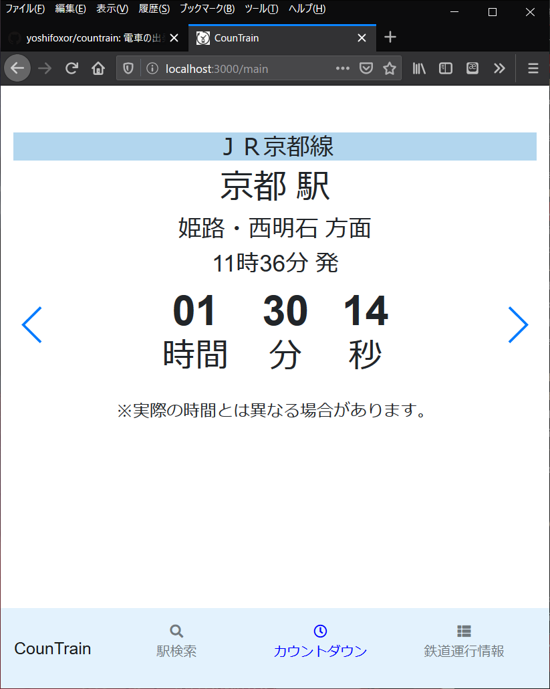

# CounTrain

電車の出発時刻をカウントダウンするWebアプリ

# DEMO

# 使い方
※ Node.js のLTS版（v8.x.x）を事前にインストールする必要があります。v8.9.4での動作を確認済みです。

Node.jsをインストール後、任意の場所にプロジェクトフォルダを配置し、コンソールで以下のコマンドを実行してください。

1. cd countrain
1. npm install
1. npm start

# 作成者
yoshifoxor
